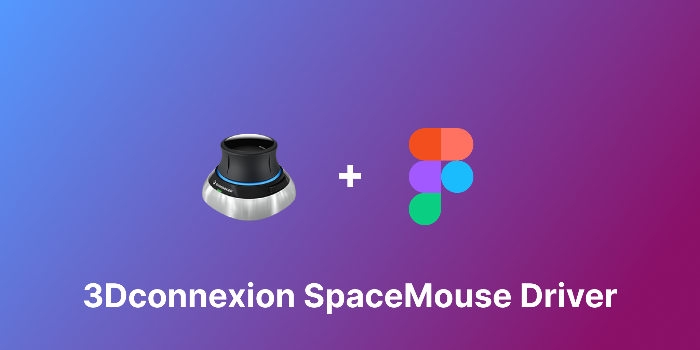

# Figma Plugin - SpaceMouse

A virtual driver that allows 3Dconnexion SpaceMouse to be used for panning and zooming in Figma

## Community contributors

- [Evgenw](https://github.com/Evgenw) - Design | Issue
- Brad G. - Issue | Debug
- [bimawa](https://github.com/bimawa) - Debug

\*Don't see your name here? Send me a PR.
