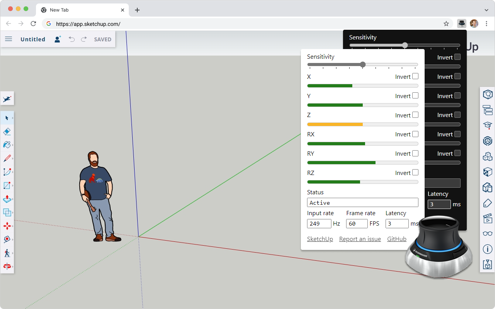

# SpaceMouse Driver for SketchUp Web

Bring your [3DConnexion SpaceMouse](https://3dconnexion.com/us/spacemouse/) to [SketchUp Web](https://app.sketchup.com)

## Install

## System requirements

- **Chromium-based browser only**. If there is enough interest, I'll add Firefox. Safari is not supported.
- **All models of SpaceMouse**, though I've only tested on the SpaceMouse Wireless in both wired and wireless mode. If your model doesn't work, please report it as bug.
- **Windows** and **Linux** are fully supported. **MacOS** is experimentally supported and not tested. If you are Mac user, please [report a bug](https://github.com/chuanqisun/sketchup-web-spacemouse/issues/new) if it does not work on your device.

## Inside SketchUp

The extension allows scene manipuation in Orbit mode. You can access the preferences and debugging UI via the extension icon button. There are some caveats:

1. Rolling Left/Right is ignored. Gravity cannot be suspended by holding <kbd>Ctrl</kbd>.
2. Zooming becomes very slow when the camera approaches the surface of an object.
3. Large models (>10MB) may experience jitter.

## How does this work?

SpaceMouse input is scanned from the browser [Gamepad API](https://developer.mozilla.org/en-US/docs/Web/API/Navigator/getGamepads) and works across platforms.

SketchUp Web does not provide official API for manipulating the camera or the scene. The extension simulates keyboard and mouse drag/scroll events to perform the navigation.

## Roadmap

I'd like to gather feedback and build features that matter the most to the users. Here are a few ideas, not necessarily ranked in any order. If you have an idea, please let me know by [submitting an issue](https://github.com/chuanqisun/sketchup-web-spacemouse/issues/new).

- **Walk mode**: use SpaceMouse to manipulate camera and look around.
- **Object mode**: use SpaceMouse to manipulate selected object, independent of other objects in the scene.
- **Button binding**: bind SpaceMouse buttons to commands in SketchUp.
- **6-DOF**: add support for rolling left/right and gravity suspension.
- **Generic joystick**: use XBox Gamepad or other USB Joystick to control SketchUp

## Disclaimer

This project is not endorsed by Trimble or 3dconnexion, though I'm happy to collaborate with both companies to improve the user experience.

## Credit

- [SpaceMouse TinkerCAD](https://github.com/arpruss/spacemouse-tinkercad)
